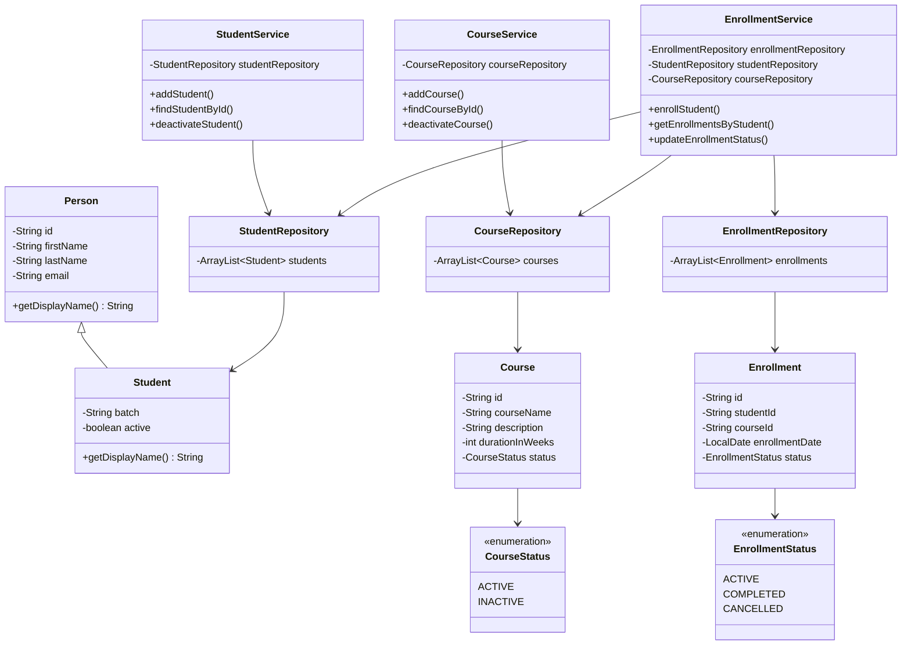

# LearnTrack — Student & Course Management System

A console-based Student & Course Management System built using Core Java, developed as a solo project to practice core OOP fundamentals: encapsulation, inheritance, polymorphism, constructors, static members, collections, and exception handling.

## Features

**Student Management**
- Add a new student
- View all students
- Search a student by ID
- Deactivate a student

**Course Management**
- Add a new course
- View all courses
- Toggle a course's active/inactive status

**Enrollment Management**
- Enroll a student in a course
- View enrollments for a specific student
- Update an enrollment's status (ACTIVE / COMPLETED / CANCELLED)

All data is stored in memory using `ArrayList` — no database or file persistence, per project scope.

## Tech Stack

- Core Java (JDK 26, developed in IntelliJ IDEA)
- No external libraries or frameworks

## Project Structure 

src/com/airtribe/learntrack/
├── Main.java # Menu-driven console entry point
├── entity/ # Person, Student, Course, Enrollment
├── repository/ # In-memory data storage (ArrayList-based)
├── service/ # Business logic layer
├── exception/ # Custom exceptions
├── util/ # IdGenerator, InputValidator
├── constants/ # MenuOptions, AppConstants
└── enums/ # CourseStatus, EnrollmentStatus 

## How to Compile and Run

**Via terminal**, from the project root:
```bash
javac -d bin src/com/airtribe/learntrack/**/*.java src/com/airtribe/learntrack/*.java
java -cp bin com.airtribe.learntrack.Main
```
(If your shell doesn't expand `**`, use `find src -name "*.java" | xargs javac -d bin` instead.)

**Via IntelliJ IDEA:**
1. Open the project folder.
2. Mark `src` as **Sources Root** (right-click → Mark Directory as → Sources Root).
3. Open `Main.java` and click the green **Run** arrow next to `main`.

See `docs/Setup_Instructions.md` for full JDK setup details.

## Class Diagram



## Documentation

- [`docs/Setup_Instructions.md`](docs/Setup_Instructions.md) — JDK version, installation, Hello World verification
- [`docs/JVM_Basics.md`](docs/JVM_Basics.md) — JDK vs JRE vs JVM, bytecode, write-once-run-anywhere
- [`docs/Design_Notes.md`](docs/Design_Notes.md) — Design decisions: ArrayList vs array, static usage, inheritance

## Author

Mridul — built as a solo portfolio project.