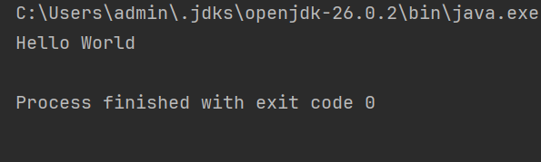

# Setup Instructions

## JDK Version Used

This project was developed and run using **IntelliJ IDEA**, configured with:

openjdk version "26.0.2"

(Project SDK, configured via File → Project Structure → SDKs in IntelliJ, JDK home path: `C:\Users\admin\.jdks\openjdk-26.0.2`)

Note: a separate JDK (17.0.13, OpenLogic OpenJDK) is also installed and available via terminal (`java -version`), but the project itself was built and tested using the JDK 26 SDK configured inside IntelliJ.

You can check your own IntelliJ project SDK via **File → Project Structure → SDKs**, or verify a terminal-installed JDK by running:
```bash
java -version
```

## Installing the JDK

1. Download OpenJDK (17+) from [https://openlogic.com/openjdk-downloads](https://openlogic.com/openjdk-downloads) or [https://adoptium.net](https://adoptium.net).
2. Run the installer and follow the setup wizard.
3. In IntelliJ IDEA, go to **File → Project Structure → SDKs**, click **+**, and point it to your installed JDK's home directory to register it as a Project SDK.
4. Verify installation by running `java -version` in a terminal — it should print the installed version details.

## Running "Hello World" to Confirm Setup

Create a file named `Hello.java`:

```java
public class Hello {
    public static void main(String[] args) {
        System.out.println("Hello, World!");
    }
}
```

Compile and run it from the terminal:

```bash
javac Hello.java
java Hello
```

Or, in IntelliJ IDEA, right-click the file and select **Run 'Hello.main()'**.

Expected output:
Hello World


This confirms the JDK is correctly installed and the `javac` (compiler) and `java` (runtime) tools are both accessible, whether via terminal or IDE.

## Compiling and Running LearnTrack

**Via terminal**, from the project's root directory:

```bash
javac -d bin src/com/airtribe/learntrack/**/*.java src/com/airtribe/learntrack/*.java
java -cp bin com.airtribe.learntrack.Main
```

(If your shell doesn't expand `**`, use `find src -name "*.java" | xargs javac -d bin` instead.)

**Via IntelliJ IDEA:**
1. Open the project folder in IntelliJ.
2. Ensure `src` is marked as the **Sources Root** (right-click `src` → Mark Directory as → Sources Root).
3. Navigate to `Main.java` and click the green **Run** arrow next to the `main` method.